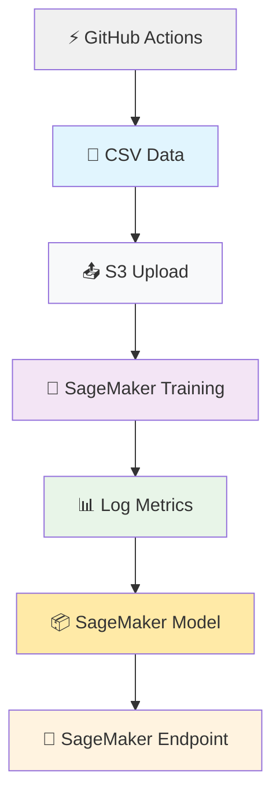
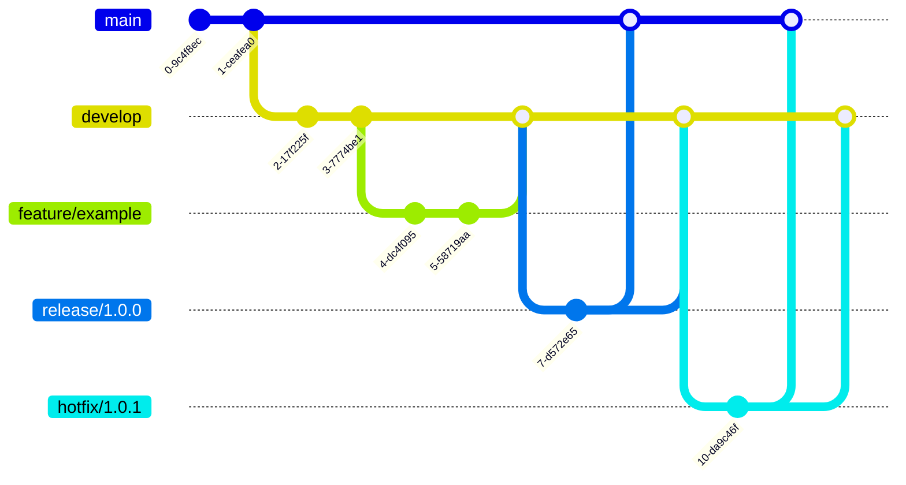
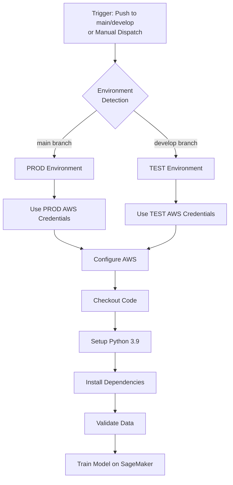

# utec-bank-grupo5

## Arquitectura



## Scaffolding
```
proyecto/
├── .github/workflows/
│   └── main.yml
├── src/
│   ├── pipeline_launcher.py
│   ├── train_script.py
│   ├── validate_date.py
├── data/
│   ├── ***.csv
└── requirements.txt
```

## Gitflow


## CI/CD pipeline

